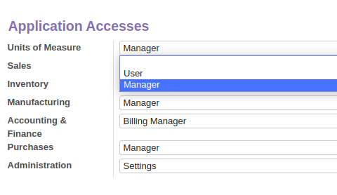
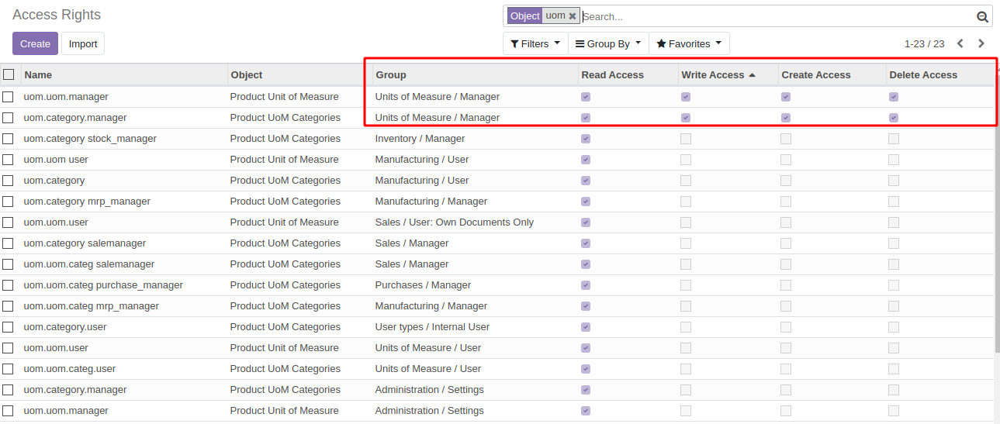

In Odoo, all a majority of modules "Managers" dealing with products (like Sales Manager,
Inventory Manager, Manufacturing Manager,...) have access rights to create/write/delete
Units of Measure whereas the Sale/Inventory/Manufacturing "Users" have only reading
rights... when part of the (misnamed) Technical group "Manage Multiple Units of Measure"
is activated.

This module helps to **clarify these UoM access rights** and groups by creating a new
group category called "Units of Measure" with two different groups :

- **User** : UoM fields are displayed but not Uom menus (Users are not allowed to create or modify UoM)
- **Manager** : display both fields and UoM menus
- and if nothing is selected, neither UoM fields nor menus are displayed

By doing so, the module also remove create/write/delete rights from other module's
Managers in order to reserve these rights to the new "Units of Measure Manager" group :

